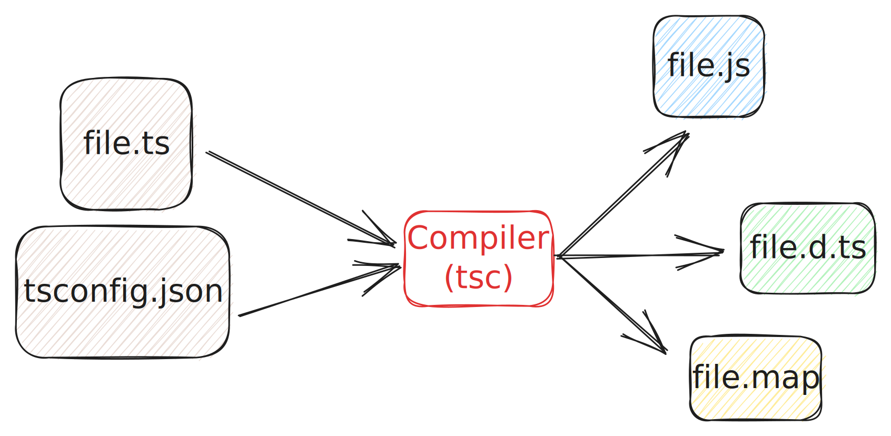
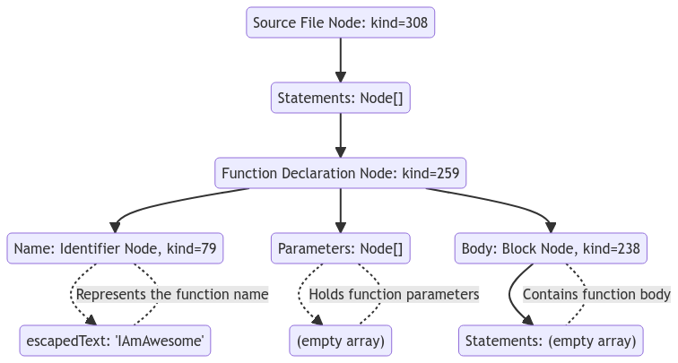
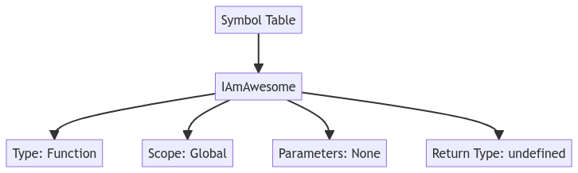

TypeScript extends JavaScript by adding types, thereby enhancing code quality and understandability through static type checking. This enables developers to catch errors at compile-time rather than runtime, resulting in more robust and maintainable codebases.

A compiler is used to process TypeScript type annotations and emit JavaScript code. The TypeScript team has built a compiler `tsc` that does this job. However, the compiler is not limited to just compiling TypeScript code to JavaScript. It can also be used to build tools and utilities around TypeScript.

In this article, you'll explore the TypeScript Compiler API, which is an integral part of the TypeScript compiler that exposes various functionalities, enabling you to interact with the compiler programmatically.

## Table of Content

## What is A Compiler?

A compiler is a specialized software program that **translates** source code written in one programming language into another language, usually machine code or an intermediate form. Compilers perform several tasks including lexical analysis, syntax analysis, semantic analysis, code generation and more.

Compilers come in various forms, serving different needs, to my understand TypeScript is a [Source-to-source](https://en.wikipedia.org/wiki/Source-to-source_compiler) compiler, which means it takes TypeScript code and compiles it into JavaScript code.

### What is The TypeScript Compiler?

The TypeScript Compiler (tsc) takes TypeScript code, which includes type information, and compiles it into plain JavaScript. It also performs type checking to catch errors at compile time rather than at runtime. The compiler utilizes an Abstract Syntax Tree (AST) to understand and transform the source code.

For the compilation to happen you need TypeScript file/code and TypeScript configuration file (tsconfig.json). The compiler will then read the configuration file and output based on the configuration:

- JavaScript code: The compiler will output JavaScript code that can be executed later on.
- Source map: A source map is a file that maps the code within a compressed file back to its original position in a source file to aid debugging. It is mostly used by the browser to map the code it executes back to its original location in the source file.
- Declaration file: A declaration file is a file that provides type information about existing JavaScript code. This enables other programs to use the values defined in the file without having to guess what they are. The TypeScript compiler generates declaration files for all the code it compiles, and you can also write your own declaration files for existing JavaScript libraries.



### What is The TypeScript Compiler API?

The TypeScript Compiler API is an integral part of the TypeScript compiler that exposes various functionalities, enabling you to interact with the compiler programmatically. With this API, you can conduct type checking, code generation, and even transform TypeScript code at a granular level. It provides a range of interfaces, functions, and classes for these interactions.

### Why would you use the Typescript Compiler API?

Using the TypeScript Compiler API has several benefits, particularly for those interested in building tools around TypeScript. You could utilize the API in a VsCode extension, [Static Code Analysis](https://snyk.io/learn/open-source-static-code-analysis/), or even to build a [DSL (Domain Specific Language)](https://martinfowler.com/dsl.html).

Personally, I used it few times to create pre-build scripts, migration scripts. For example, Angular recently introduced the [Standalone Components](https://angular.io/guide/standalone-components), which is a new way to write Angular components without the need to create a module. I had a lot of components that I wanted to migrate to this new way. Imagine doing this manually, it would take a lot of time and effort. [Angular team created a migration script](https://github.com/angular/angular/blob/main/packages/core/schematics/ng-generate/standalone-migration/to-standalone.ts) that does this automatically, and it's using the Typescript Compiler API.

There are few interesting projects that utilize the Typescript Compiler API, such as:

- [Compile JSONSchema to TypeScript type declarations](https://github.com/bcherny/json-schema-to-typescript)
- [TypeScript AST Viewer](https://ts-ast-viewer.com/)
- [TypeScript API generator via Swagger scheme](https://github.com/acacode/swagger-typescript-api)

In case you want build rules to enforce on your codebase, you can use [ESLint](https://eslint.org/) instead. [I have wrote a guide for you](https://techtext.dev/posts/gentle-introduction-to-eslint-rules)

_So you don't get confused, Using ESLint is a better option if you want to enforce rules on your codebase due to the fact that it's specifically built for that purpose. However, if you want to build a tool that does something more complex, then the Typescript Compiler API is the way to go._

## Use Case: Enforce One Class Per File

Let's stop talking and start coding. You're going to use the Typescript Compiler API to enforce one class per file. This is a common rule that is used in many codebases.

_Don't worry if you don't understand the code, You'll continue learning about the compiler API in the next section._

_Hint: I strongly recommend you check the code again before going to the next use case._

```ts
const tsconfigPath = "./tsconfig.json"; // path to your tsconfig.json
const tsConfigParseResult = parseTsConfig(tsconfigPath);
const program = ts.createProgram({
  options: tsConfigParseResult.options,
  rootNames: tsConfigParseResult.fileNames,
  projectReferences: tsConfigParseResult.projectReferences,
  configFileParsingDiagnostics: tsConfigParseResult.errors,
});

/**
 * Apply class per file rule
 */
function classPerFile(file: ts.SourceFile) {
  const classList: ts.ClassDeclaration[] = [];

  // file.forEachChild is a function that takes a callback and calls it for each direct child of the node

  // Loops over all nodes in the file and push classes to classList
  file.forEachChild(node => {
    if (ts.isClassDeclaration(node)) {
      classList.push(node);
    }
  });

  // If there is more than one class in the file, throw an error
  if (classList.length > 1) {
    throw new Error(`
      Only one class per file is allowed.
      Found ${classList.length} classes in ${file.fileName}
      File: ${file.fileName}
	`);
  }
}

const files = program.getSourceFiles();

// Loops over all files in the program and apply classPerFile rule
files
  .filter(file => !file.isDeclarationFile)
  .forEach(file => classPerFile(file));
```

I know what you're thinking, this is a lot of code. Let's break it down, there are few key terms that you need to know:

- Program
- Source File
- Node
- Declaration

## TypeScript Program

When working with the TypeScript Compiler, one of the central elements you'll encounter is the **Program** object. This object serves as the starting point for many of the operations you might want to perform, like type checking, emitting output files, or transforming the source code. The Program is created using the `ts.createProgram` function, which can accept a variety of configuration options, such as

- `options`: These are the compiler options that guide how the TypeScript Compiler will behave. This could include settings like the target ECMAScript version, module resolution strategy, and whether to include type-checking errors, among others.
- `rootNames`: This property specifies the entry files for the program. It usually contains an array of filenames that act as the roots from which the TypeScript Compiler will begin its operations. These are often the .ts or .tsx files that serve as entry points to your application or library.
- `projectReferences`: If your TypeScript project consists of multiple sub-projects that reference each other, this property is used to manage those relationships.
- `configFileParsingDiagnostics`: This property is an array that will capture any diagnostic information or errors that arise when parsing the tsconfig.json file.

```ts
const tsconfigPath = "./tsconfig.json"; // path to your tsconfig.json
const tsConfigParseResult = parseTsConfig(tsconfigPath);

const program = ts.createProgram({
  options: tsConfigParseResult.options,
  rootNames: tsConfigParseResult.fileNames,
  projectReferences: tsConfigParseResult.projectReferences,
  configFileParsingDiagnostics: tsConfigParseResult.errors,
});
```

In this sample, a TypeScript program is created from tsconfig parsing results.

## Source File

Writing code is actually writing text, you understand it because you know the language, the semantics, the syntax, etc. But the computer doesn't understand it, it's just a text.

The compiler will take this text and transform it into something that can be utilised. This transformation is called **parsing** and its output is called **Abstract Syntax Tree (AST)**.

A source file as a representation of a file in your project, it contains information about the file, such as its name, path, and contents.

The AST is a tree-like data structure and as any tree, it has a root node. The root node is **Source File**.

## Abstract Syntax Tree (AST)

The code you write is essentially a text that isn't useful unless it can be parsed. That parsing process produces a tree data structure called AST, it contains a lot of information like the name, kind, and position of the node in the source code.

The AST is used by the compiler to understand the code and perform various operations on it. For example, the compiler uses the AST to perform type checking.

The following code:

```ts
function IAmAwesome() {}
```

Will be transformed into the following AST:

```json
{ // -> Source File Node
  "kind": 308,
  "statements": [ // -> Node[]
    { // -> Function Declaration Node
      "kind": 259,
      "name": { // -> Identifier Node
        "kind": 79,
        "escapedText": "IAmAwesome"
      },
      "parameters": [], // Node[]
      "body": { // Block Node
        "kind": 238,
        "statements": []
      }
    }
  ]
```



## Node

In AST, the fundamental unit is called a Node.

**Kind**: A numeric value that represents the specific type or category of that node. For instance:

- FunctionDeclaration has kind 259
- Block has kind 238
  These numbers are exported in an enum called `SyntaxKind`

The node object has more than just these properties but right now we're only interested in a few, nonetheless, two additional important properties you might want to know about are:

**Parent**: This property points to the node that is the parent of the current node in the AST.

**Flags**: These are binary attributes stored as flags in the node. They can tell you various properties of the node, such as whether it's a read-only field if it has certain modifiers.

## Declaration

Remember the use case you're trying to solve? enforce one class per file. To do that, you need to check if more than one class is **declared** in the file.

A declaration is node that declares something, it could be a variable, function, class, etc.

```ts
class Test {
  runner: string = "jest";
}
```

In this example we have two declarations:

- `Test` -> `ClassDeclaration`
- `runner` -> `PropertyDeclaration`

The key difference between a node and a declaration is that

- A "Node" is a generic term that refers to any point in the AST, irrespective of what it represents in the source code.

- A "Declaration" is a specific type of node that has a semantic role in the program: it introduces a new identifier and provides information about it.

## Statement

A statement is a node that represents a statement in the source code. A statement is a piece of code that performs some action. For example, a variable declaration is a statement that declares a variable.

```ts
let a = 1;
```

In this example the variable declaration `let a = 1;` is a statement.

## Expression

An expression is a node in the code that evaluates to a value. For instance, in the variable declaration `let a = 1 + 2;`, the part `1 + 2` is an expression, specifically a binary expression. Another example would be `(a: number, b: number) => a + b`, which is as an arrow function expression.

- `let a = 1 + 2;` : 1 + 2 is an expression, specifically a binary expression

- `const add = function addFn(a: number, b: number) { }`: `function ...` is an expression, specifically a function expression.

Let's break down the following code:

```ts
const first = 1,
  second = 2 + 3,
  third = whatIsThird();
```

- The whole code is a `VariableStatement` node.
- `const first = 1, second = 2 + 3, third = whatIsThird();` is a `VariableDeclarationList` node.
- `first = 1`, `second = 2 + 3` and `third = whatIsThird()` are a `VariableDeclaration` nodes.
- `first`, `second`, and `third` are `Identifier` nodes.
- `1`, `2 + 3`, and `whatIsThird()` are `NumericLiteral`, `BinaryExpression`, and `CallExpression` nodes respectively.



## Use Case: No Function Expression

Let's take another example to recap what you've learned so far. You're going to use the Typescript Compiler API to enforce no function expression.

- Function declaration:

```ts
function addFn(a: number, b: number) {
  return a + b;
}
```

- Function Expression

```ts
let add = function addFn(a: number, b: number) {
  return a + b;
};
```

You need to ensure only the first one is allowed.

```ts
const transformer: (
  file: ts.SourceFile
) => ts.TransformerFactory<ts.SourceFile> = function (file) {
  return function (context) {
    const visit: ts.Visitor = node => {
      if (ts.isVariableDeclaration(node)) {
        if (node.initializer && ts.isFunctionExpression(node.initializer)) {
          throw new Error(`
					No function expression allowed.
					Found function expression in ${file.fileName}
					File: ${file.fileName}
				`);
        }
      }

      // visit each child node
      return ts.visitEachChild(node, visit, context);
    };

    // visit each node in the file
    return node => ts.visitEachChild(node, visit, context);
  };
};

const files = program.getSourceFiles();

files
  .filter(file => !file.isDeclarationFile)
  .forEach(file => ts.transform(file, [transformer(file)]));
```

I know this isn't like the first example, but it's similar.

In the first use case, it was enough to loop over the first level nodes in the file, but in this use case, you need to loop over all nodes in the file, the nested ones as well.

Few key terms that you need to know:

- Transformer
- Visitor
- Context

## Transformer

That transformer function is important because it provides context that happens to be needed to walk the AST. The transformer function is called for each file in the program, and it returns a function that is called for each node in the AST.

As the name implies, the transformer function can transform the AST (the code) in any way you want. In this example, you're using it to enforce a rule, however, instead of throwing an error, you can transform the code to fix the error.

_Slowlly read the code 🐢_

_[See how the AST for the function expression looks like](https://ts-ast-viewer.com/#code/DYUwLgBAhgJjEF4IDMCuA7AxmAlge3WjgDF0AKKALgnVQFsAjEAJwBoIHrbGWBKCAN4AoCKNHNwqZoSgQA1BwDcQgL5A)_

```ts
const transformer: (
  file: ts.SourceFile
) => ts.TransformerFactory<ts.SourceFile> = function (file) {
  let fixes: ts.Statement[] = [];
  return function (context) {
    // The visit function
    const visit: ts.Visitor = node => {
      if (ts.isVariableStatement(node)) {
        const varList: ts.VariableDeclaration[] = [];
        const functionList: ts.FunctionExpression[] = [];

        // collect function expression and variable declaration
        for (const declaration of node.declarationList.declarations) {
          if (declaration.initializer) {
            if (ts.isFunctionExpression(declaration.initializer)) {
              functionList.push(declaration.initializer);
            } else {
              varList.push(declaration);
            }
          }
        }

        // create function declaration out of function expression
        fixes.push(
          ...functionList.map(initializer =>
            ts.factory.createFunctionDeclaration(
              initializer.modifiers,
              initializer.asteriskToken,
              initializer.name as ts.Identifier,
              initializer.typeParameters,
              initializer.parameters,
              initializer.type,
              initializer.body
            )
          )
        );

        // if variable declaration is empty, remove the variable list statement
        if (varList.length === 0) {
          return undefined;
        }

        // if variable declaration is equal to the total number of declarations
        // it means no function expression found, return the node as is
        if (varList.length === node.declarationList.declarations.length) {
          return node;
        }

        return ts.factory.createVariableStatement(
          node.modifiers,
          ts.factory.createVariableDeclarationList(varList)
        );
      }

      return ts.visitEachChild(node, visit, context);
    };

    return node => {
      const updatedNode = ts.visitEachChild(node, visit, context);
      const statements = [...fixes, ...updatedNode.statements];

      // Reset fixes for the next file
      fixes = [];

      return ts.factory.updateSourceFile(
        node,
        statements,
        node.isDeclarationFile,
        node.referencedFiles,
        node.typeReferenceDirectives,
        node.hasNoDefaultLib,
        node.libReferenceDirectives
      );
    };
  };
};
```

## Visitor

I hope you noticed the `visit` function 😁, Let's talk about it, it is a simpler version of what is called the Visitor Pattern. An essential part of how the TypeScript Compiler API works. Actually, you'll see that design pattern whenever you work with AST, Hey at least I did!

A "visitor" is basically a function you define to be invoked for each node in the AST during the traversal. The function is called with the current node and has few return choices.

- Return the node as is (no changes).
- Return a new node of the same kind (otherwise might disrupt the AST) to replace it.
- Return undefined to remove the node entirely.
- Return a visitor `ts.visitEachChild(node, visit, context)` which will visit the node children if have.

## Context

## Use Case: Detect Third-Party Classes Used as Superclasses

## How The Compiler Works

Before starting with API, you have to know how the compiler works.

The compiler is a pipeline that consists of several stages, each stage takes the output of the previous stage and transforms it into something else.

Let's say you have a file named `awesome.ts` with the following content:

```ts
function IAmAwesome() {}
```

The compiler pipeline consists of the following stages:

### Lexical Analysis

The first stage of the compiler pipeline is the lexical analysis stage. In this stage, the compiler takes the source code and breaks it down into a series of tokens. A token is a characters or sequence of characters that can be treated as a single unit. Taking the `awesome.ts` file as an example, the compiler will break it down into the following tokens:

`function` `IAmAwesome` `(` `)` `{` `}`

[_Check how `function` is represented_](https://github.com/microsoft/TypeScript/blob/97147915ab667a52e31ac743843786cbc9049559/src/compiler/scanner.ts#L153)

### Syntax Analysis

The second stage of the compiler pipeline is the syntax analysis stage. In this stage, the compiler takes the tokens generated in the previous stage and uses them to build a tree-like structure called an Abstract Syntax Tree (AST). The AST represents the syntactic structure of the source code.

Some stuff that the compiler does in this stage:

- It will check if a function has a body.
- It will check if a function has a name.

The part of the compiler that does this is called the **Parser**. The parser is responsible for parsing the tokens and building the AST. The AST is then used by the semantic analysis stage to perform type checking and other semantic checks.

### Semantic Analysis

The third stage of the compiler pipeline is the semantic analysis stage. In this stage, the compiler takes the AST generated in the previous stage and uses it to perform type checking and other semantic checks. It also builds a symbol table using the Binder component.

#### Type Checking

TypeScript extends JavaScript by adding types. The compiler uses the AST to enforce type constraints and rules. The goal here is to catch type errors, such as trying to access a property that doesn't exist on an object, at compile time rather than at runtime.

This stage ensures the types declared in the source code align correctly with the types being manipulated, thereby reducing the likelihood of errors once the code is in execution.

```ts
let a: number = "string";
// This will trigger a type error during this stage
```

#### Binder

The binder is a part of the compiler responsible for associating identifiers -declarations- in the code (like variable names, function names, etc.) with corresponding symbols. After the Abstract Syntax Tree (AST) is generated by the parser, the binder walks through it and creates symbols for the various identifiers found.

- For each declaration that it finds, it creates a **Symbol** that records its location and kind of declaration.
- Stores that symbol in a **SymbolTable** in the containing node, like a function, block or module file, that is the current scope.

Symbols let the type checker look up names and then check their declarations to determine types. It also contains a small summary of what kind of declaration it is -- mainly whether it is a value, a type, or a namespace.

#### Symbol

The term "symbol" refers to a **named entity** in the source code. Symbols could represent variables, functions, classes, and so forth. During the semantic analysis stage, each of these named entities is analyzed to understand its context and usage within the code.

_**named entity** is a name that is used to identify something. It could be a variable name, function name, class name, etc. In other words any Identifier Node._

A symbol is represented by the `Symbol` interface, which has the following properties:

```ts
interface Symbol {
  flags: SymbolFlags;
  escapedName: __String;
  declarations?: Declaration[];
  valueDeclaration?: Declaration;
  members?: SymbolTable;
  exports?: SymbolTable;
  globalExports?: SymbolTable;
}
```

- `flags`: The flags associated with the symbol which can be used to determine the type of symbol -variable, function, class, interface, etc.-
- `escapedName`: The name of declaration associated with the symbol.
- `declarations`: List of declarations associated with the symbol, think of function/method override.
- `valueDeclaration`: Points to the declaration that serves as the "primary" or "canonical" declaration of the symbol. In simpler terms, it's the declaration that gives the symbol its "value" or "meaning" within the code. For example, if you have a variable initialized with a function, the valueDeclaration would point to that function expression.
- `members`: Symbol table that contains information about the properties or members of the symbol. For instance, if the symbol represents a class, members would contain symbols for each of the class's methods and properties.
- `exports`: Similar to members, but this is more relevant for modules. It contains the symbols that are exported from the module.
- `globalExports`: This is another symbol table but it's used for global scope exports.

`SymbolTable` is a map of symbols, where the key is the name of the symbol and the value is the symbol itself.

```ts
type SymbolTable = Map<__String, Symbol>;
```

Let's take the following example

```ts
class Test {
  runner: string = "jest";
}
```

The symbol for class "Test" will have the following properties:

```ts
const classTestSymbol = {
  flags: 32,
  escapedName: "Test",
  declarations: [ClassDeclaration],
  valueDeclaration: ClassDeclaration,
  members: {
    runner: // Symbol for runner property
  },
};
```

#### Symbol Table

This is a data structure (hash map usually) used by a compiler to keep track of symbols. It stores symbols keyed by their names, allowing the compiler to quickly look up information about an identifier. It is used extensively during type checking.

This is how it looks internally:

```ts
export function createSymbolTable(symbols?: readonly Symbol[]): SymbolTable {
  const result = new Map<__String, Symbol>();
  if (symbols) {
    for (const symbol of symbols) {
      result.set(symbol.escapedName, symbol);
    }
  }
  return result;
}
```



## Conclusion

## Next Steps

## References

- [Codebase Compiler Binder](https://github.com/microsoft/TypeScript/wiki/Codebase-Compiler-Binder#binder)
- [TypeScript Compiler Notes](https://github.com/microsoft/TypeScript-Compiler-Notes)
