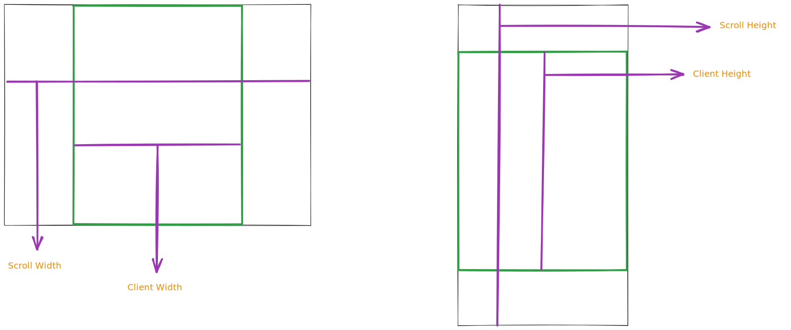
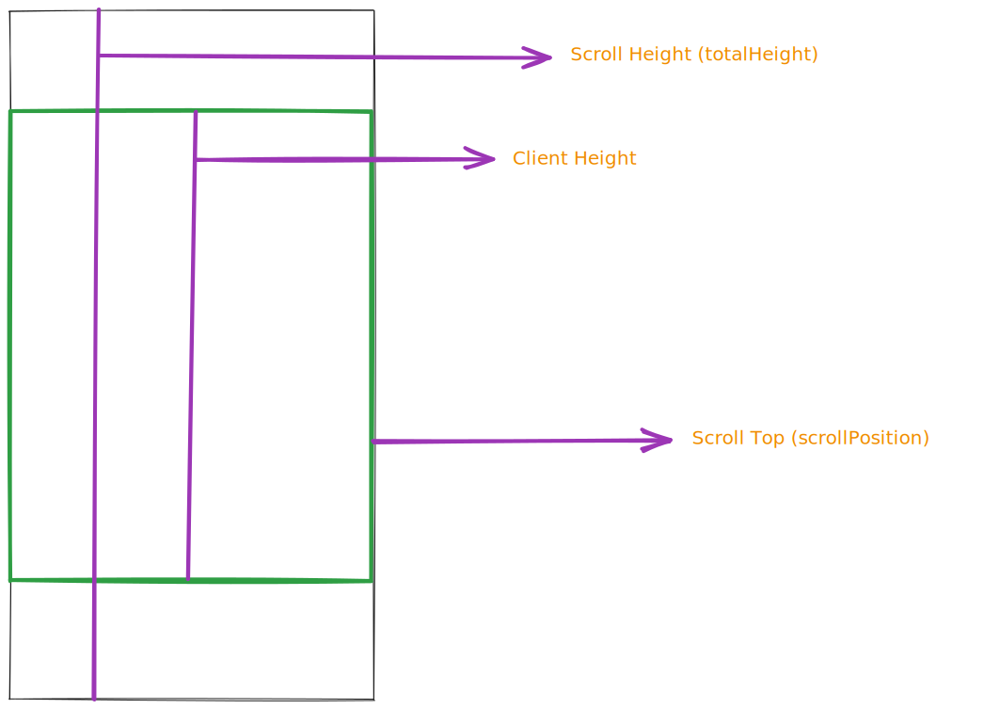
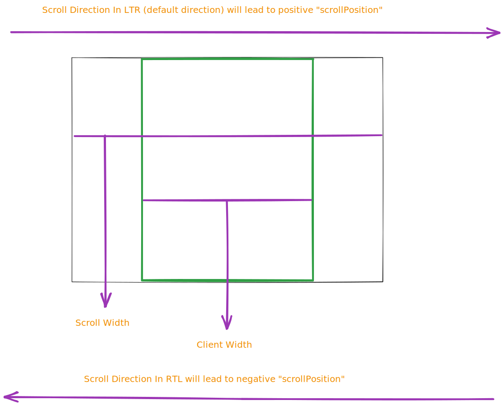

Ever tried to load a ton of data on a webpage and found it super slow or clunky? Yeah, we've all been there. One good way to make things smoother is by using infinite scrolling. Like how your Twitter feed just keeps loading more tweets as you scroll down.

[What is Infinity Scroll](https://builtin.com/ux-design/infinite-scroll)

> A web design technique where, as the user scrolls down a page, more content automatically and continuously loads at the bottom, eliminating the user’s need to click to the next page.

## Table of content

## Problem

Infinite scrolling is often used for a few key reasons:

- Data Fetching: Loading large data sets all at once can lead to latency issues or even browser crashes. It's better to load data incrementally to maintain performance.

- Mobile Usability: On mobile platforms, scrolling is more intuitive than navigating through multiple pages.

- Resource Optimization: Incremental data loading is generally more resource-efficient, reducing the load on both the server and the client, which can lead to faster load times and a better user experience.

## Solution

We are going to build a minimal yet efficient function using RxJS and TypeScript (optional).

- Vertical Scroll Support
- Horizontal Scroll supports both LTR and RTL
- Threshold to dictate when additional data should be fetched
- Data Loading State
  The writing presumes that you have a basic understanding of RxJS. We'll learn about the used RxJS operator and any unusual code along the way.

Let's start

## RxJS operators

RxJS operators are functions that manipulate and transform observable sequences. These operators can be used to filter, combine, project, or perform other operations on an observable sequence of events.

There are a lot of them, most used (by me 😆) are `tap`, `map`, `filter`, `switchMap`, and `finalize`. You might already know how to use those but lucky you, we're going to learn about other useful operators!

Take a look at the following observable:

```ts
const source$ = from([1, 2, 3, 4, 5]);
source$.subscribe(event => console.log(event));
```

The result would be 1 2 3 4 5. -Each in a new line-

### filter

Let's say we only want to log odd numbers

```ts
const source$ = from([1, 2, 3, 4, 5]);
source$.pipe(filter(event => event % 2)).subscribe(event => console.log(event));
```

Perhaps there's a chance the `source$` might emit a `null` event so we use a filter to prevent it from going through the rest of the source sequence

```ts
const source$ = from([1, 2, 3, null, 5]);
source$
  .pipe(filter(event => event !== null))
  .subscribe(event => console.log(event));
```

### map

To transform the sequence of events we can use the `map` operator

```ts
source$
  .pipe(map(event => (event > 3 ? `Large number` : "Good enough")))
  .subscribe(event => console.log(event));
```

What if I want to inspect an event without changing the source sequence

### tap

```ts
source$
  .pipe(
    tap(event => {
      logger.log("log an event in the console");
      // you can perform any operation as well, however return statment are ignore in tap function
    })
  )
  .subscribe(event => console.log(event));
```

### finalize

To catch the end of an observable lifetime we need to keep an eye there, that what `finalize` do, is called upon observable completion (complete notification)

It is usually used to perform some cleanup operations, stop the loading animation, or debug the memory, for example, add a log statement to ensure that the observable is complete and doesn't stuck in the memory 🥲.
Before starting with map operators, my advise

### switchMap

Sometimes we need to call a backend server to fetch some data on every emission, we've a few methods to accomplish that.

Like a normal `map` but its function argument -project function- has to return an observable, we call it inner observable. When an event comes through it'll create a subscription from the inner observable and hold that pending till the inner observable completes. If a new event comes through while the previous inner observable hasn't yet been completed then `switchMap` will cancel that observable and subscribe to the new one.

```ts
const source$ = from([1, 2, 3, 4, 5]);

function fetchData(id: number) {
  return from(fetch(`https://jsonplaceholder.typicode.com/todos/{id}`));
}

source$
  .pipe(switchMap(event => fetchData(event)))
  .subscribe(event => console.log(event));
```

Worth noting that in this sample only the todo with id 5 will be logged because `switchMap` works by **switching** the priority to the recent event as explained above. `from([...])` will emit the events after each other immediately thereby `switchMap` will switch (subscribe) to the next event inner observable as soon as it arrives without regard to the previous event. The switch operation essentially means unsubscribing from the previous inner observable and subscribing to the new one.

### concatMap

It blocks new events from going through the source sequence unless the inner observable completes. It is particularly useful for database writing operations or animating/moving an element

```ts
source$
  .pipe(concatMap(event => fetchData(event)))
  .subscribe(event => console.log(event));
```

This sample will log all todos in order. Essentially what happens is `concatMap` blocks the next event till the inner observable at hand completes.

### mergeMap

It doesn't cancel the previous inner observable nor blocks the source sequence till the current inner observable completes. `mergeMap` will subscribe to the event inner observable without regard to its completion, so if an event came through and the previous inner observable hasn't been completed yet that's fine, `mergeMap` will subscribe to them in parallel.

```ts
source$
  .pipe(mergeMap(event => fetchData(event)))
  .subscribe(event => console.log(event));
```

This sample will log all todos but in uncertain order, for instance, the second request might resolve before the first one and `mergeMap` doesn't care about the order, if that is important then use `concatMap`.

### exhaustMap

The final one and the most important in this writing is `exhaustMap`: it is like `switchMap` but with one key difference; it ignores the recent events in favor of the current inner observable completion in contrary to `switchMap` which cancels the previous inner observable in favor of new inner observable.

```ts
source$
  .pipe(exhaustMap(event => fetchData(event)))
  .subscribe(event => console.log(event));
```

This sample will only log the first todo as the first todo request hasn't been completed yet other events came through therefore they've been ignored.

To summarise

1. `switchMap` will unsubscribe from the current inner observable (if hasn't been completed yet) in favor of the next even inner observable.
2. `concatMap` will block the source sequence so the inner observable at hand must be complete before allowing other events to flow.
3. `mergeMap` doesn't care about the status of the inner observable so it'll subscribe to the inner observable without worrying about the previous inner observable.
4. `exhaustMap` will ignore any event till the current inner observable is complete.

Okay, that is a lot, isn't it? I understand that if you're new to RxJS you might not be able to digest all this info, your best bet is to practice and that's what we're trying to do here!

We've three other operators we need to touch on

### debounceTime

You're building a login form and upon the user typing its password you want to hit the backend server to ensure the password conforms to certain criteria.

```ts
condt source$ = fromEvent(passwordInput, 'input').pipe(
  map((event) => passwordInput.value),
  switchMap((password) => checkPasswordValidaity(password))
)
source$.subscribe(event => console.log(event));
```

This example might work just fine with one key caveat; on every keystroke, we'll be sending a request to the backend server, thanks to `switchMap` it'll cancel previous requests so there might not be as much harm, still we have an operator that can improve this operation, `debounceTime`, it ignores any events till the `dueTime` -argument- is pass.

```ts
condt source$ = fromEvent(passwordInput, 'input').pipe(
  debounceTime(2000)
  map((event) => passwordInput.value),
  switchMap((password) => checkPasswordValidaity(password))
)
source$.subscribe(event => console.log(event));
```

Adding `debounceTime` essentially implies creating 2 seconds between each keystroke, so a user enters "hello" and then before 2 seconds pass enters "world" and only one request will be sent. In other words, each event has to have a 2 seconds distance from the last event.

### startWith

An observable might not have value immediately and you need an event readily available for the new `source$` subscribers.

```ts
const defaultTimezone = '+1'
condt source$ = fromEvent(timezoneInput, 'input').pipe(
  map((event) => timezoneInput.value),
  startWith(defaultTimezone)
)
source$.subscribe(event => console.log(event));
```

This sample will immediately log "+1" even if `timezoneInput` value is never entered

### fromEvent

We could rewrite the previous example to be as follows

```ts
const timezoneInputController = new Subject<string>();
const timezoneInputValue$ = timezoneInputController.asObservable();
timezoneInput.addEventListener("input", () =>
  subject.next(timezoneInputController.value)
);

const source$ = timezoneInputValue$.pipe(
  map(event => event.target.value),
  startWith(defaultTimezone)
);
source$.subscribe(event => console.log(event));
```

Thanks to RxJS we can use `fromEvent` that will encapsulate that boilerplate, all we need to do is to say which event to listen to from what element. Of course `fromEvent`` returns an observable 🙂.

### takeUntil

I admit that might be difficult to digest, it was for me. Taking the same previous example, Let's say that we have a form and an input and submit button. When the user clicks on the submit button we no longer want to listen to the `timezoneInput` element `input` event, yes, `takeUntil` as it sounds, it lets the subscribers take the events until the provided observable emits at least once.

```ts
const formSubmission$ = fromEvent(formEl, 'submit')

const defaultTimezone = '+1'
condt source$ = fromEvent(timezoneInput, 'input').pipe(
  map((event) => timezoneInput.value),
  startWith(defaultTimezone)
)
// normally, this subscriber will keep logging the event even if the users clicked on the submit button
source$.subscribe(event => console.log(event));

// Now, once the submit button are clicked the subscriber subscription will be canceled
source$
  .pipe(takeUntil(formSubmission))
  .subscribe(event => console.log(event));
```

### pipe

The pipe function in RxJS is a utility for composing operations on observables. Use it to chain multiple operators together in a readable manner, or to create reusable custom operators. This is crucial when the source sequance is complex to manage.

```ts
import { pipe } from "rxjs"; // add it to not to be confused with Observable.pipe

// Create a reusable custom operator using `pipe`
const filterAndDouble = pipe(
  filter((n: number) => n % 2 === 1),
  map((n: number) => n * 2)
);

const source$ = from([1, 2, 3, 4, 5]);

source$.pipe(filterAndDouble).subscribe(x => console.log(x));
```

Wow, I really did it, and you did too 😎

Time to talk about some of the Scroll API(s)

## Scroll API

You already know the _Scroll Bar_, it's at the right end of the page 🥸, no really, when you the user scroll in any direction the browser emits a few events, like `scroll`, `scrollend`, and `wheel`.

We're going to learn enough that we can tackle the problem at hand.

Let's start with `scroll` and `scrollend`:

### Scroll and ScrollEnd Events

The `scroll` event fires while an element is being scrolled and `scrollend` fires when scrolling has completed.

```ts
element.addEventListener("scroll", () => {
  console.log(`I'm being scrolled`);
});

element.addEventListener("scrollend", () => {
  console.log(`User stopped scrolling`);
});
```

Keep in mind that this only works if the element—the one that has the event listener (handler)—is scrollable, not its parent or any ancestor or descendant elements.

### Wheel Event

The `wheel` event fires while an element or any of its children is being scrolled using the mouse/trackpad **wheel** which means trying to scroll down/up using the keyboard won't trigger it.

### Dimensions and Properties

We will focus mainly on the scroll event for our current tasks. Nevertheless, I've sketched out these additional events and properties for a comprehensive understanding. Let's delve into key dimensional properties we need:

- `element.clientWidth`: The inner width of the element, excluding borders and scrollbar.
- `element.scrollWidth`: The width of the content, including content not visible on the screen. If the element is not horizontally scrollable then it'd be the same as ` clientWidth``.
- `element.clientHeight`: The inner height of the element, excluding borders and scrollbar.
- `element.scrollHeight`: The height of the content, including content not visible on the screen. If the element is not vertically scrollable then it'd be the same as `clientHeight`.
- `element.scrollTop`: The number of pixels that the content of an element is scrolled vertically.

_Note: When I say "the content," I mean the entirety of what's contained within the HTML element._



<center>
  The green box is the element while the black box on the left is the width overflow
  and on the right is the height overflow
</center>

Let's take the following example, Calculate the remaining pixels from the user's current scroll position to the end of the scrollable element.

```ts
function calculateDistanceFromBottom(element: HTMLElement) {
  const scrollPosition = element.scrollTop;
  const clientHeight = element.clientHeight;
  const totalHeight = element.scrollHeight;
  return totalHeight - (scrollPosition + clientHeight);
}
```

Take a look at the below image.



<center>scrollPosition indicates to what point the user scrolled</center>

Presuming the `totalHeight` is `500px`, `clientHeight` `300px`, and the `scrollPosition` is `100px`, deducting the sum of `scrollPosition` and `clientHeight` from `totalHeight` would result in `100px` which is the remaining distance to reach the bottom of the element.

Similar formula when calculating the remaining distance to the end horizontally

```ts
function calculateRemainingDistanceOnXAxis(element: HTMLElement): number {
  const scrollPosition = Math.abs(element.scrollLeft);
  const clientWidth = element.clientWidth;
  const totalWidth = element.scrollWidth;
  return totalWidth - (scrollPosition + clientWidth);
}
```

Presuming the `totalWidth` is `750px`, `clientWidth` `500px` and the `scrollPosition` is `150px`, deducting the sum of `scrollPosition` and `clientWidth` from `totalWidth` would result in `100px` which is the remaining distance to reach the end of the XAxis.
You might have noticed the `Math.abs` being used and that due to RTL direction where the user has to go in the reverse direction which would make the `scrollPosition` value to be negative so using `Math.abs` to unify it in both directions.



Given the data we've about the element dimension we can also create a function to check if the element is scrollable or not

```ts
type InfinityScrollDirection = "horizontal" | "vertical";

function isScrollable(
  element: HTMLElement,
  direction: InfinityScrollDirection = "vertical"
) {
  if (direction === "horizontal") {
    return element.scrollWidth > element.clientWidth;
  } else {
    return element.scrollHeight > element.clientHeight;
  }
}
```

Simply put, if the element scroll dimension is the same as its client dimension then it isn't scrollable.

## The Code

I know you've been looking around to find this section, finally, we'll put all the learnings into action, let's start by creating a function named `infinityScroll` that accepts `options` argument

```ts
export interface InfinityScrollOptions<T> {
  /**
   * The element that is scrollable.
   */
  element: HTMLElement;
  /**
   * A BehaviorSubject that emits true when loading and false when not loading.
   */
  loading: BehaviorSubject<boolean>;
  /**
   * Indicates how far from the end of the scrollable element the user must be
   * before the loadFn is called.
   */
  threshold: number;
  /**
   * The initial page index to start loading from.
   */
  initialPageIndex: number;
  /**
   * The direction of the scrollable element.
   */
  scrollDirection?: InfinityScrollDirection;
  /**
   * The function that is called when the user scrolls to the end of the
   * scrollable element with respect to the threshold.
   */
  loadFn: (result: InfinityScrollResult) => ObservableInput<T>;
}

function infinityScroll<T extends any[]>(options: InfinityScrollOptions<T>) {
  // Logic
}
```

As promised before, our infinity scroll function is customizable. Now we're going to listen to the element -_the one that has list of item that is supposed to infinitly scrolled_-

```ts
function infinityScroll<T extends any[]>(options: InfinityScrollOptions<T>) {
  return fromEvent(options.element, "scroll").pipe(
    startWith(null),
    ensureScrolled,
    fetchData
  );
}
```

- `fromEvent` listens to `scroll` event of the scrollable element.
- `startsWith` starts the event sequence to fetch the first batch of data.
- `ensureScrolled` is a chainable operator that confirms the scroll position surpasses the predefined threshold before proceeding.
- `fetchData` is another chainable operator that fetches data based on the `pageIndex`, more on that later.

### ensureScrolled

```ts
const ensureScrolled = pipe(
  filter(() => !options.loading.value), // ignore scroll event if already loading
  debounceTime(100), // debounce scroll event to prevent lagginess on heavy scroll pages
  filter(() => {
    const remainingDistance = calculateRemainingDistance(
      options.element,
      options.scrollDirection
    );
    return remainingDistance <= options.threshold;
  })
);

function calculateRemainingDistance(
  element: HTMLElement,
  direction: InfinityScrollDirection = "vertical"
) {
  if (direction === "horizontal") {
    return calculateRemainingDistanceOnXAxis(element);
  } else {
    return calculateRemainingDistanceToBottom(element);
  }
}
```

- `filter` only passes the scroll events if the element is scrollable, otherwise, it might lead to unexpected behavior.
- `debounceTime` will skip any event, in our case scroll events from flowing the sequence
- `filter` is checking if the `remainingDistance` either to the bottom (in case of vertical scrolling) or to the end of XAxis in case of horizontal scrolling is less than the `threshold`. Presuming `threshold` is 100px then when the scroll position is within 100 pixels of reaching the end (either vertically or horizontally, depending on the configuration), loadMore.next() will be invoked, signaling that more content should be loaded.

### fetchData

```ts
const fetchData = pipe(
  exhaustMap((_, index) => {
    options.loading.next(true);
    return options.loadFn({
      pageIndex: options.initialPageIndex + index,
    });
  }),
  tap(() => options.loading.next(false)),
  // stop loading if error or explicitly completed (no more data)
  finalize(() => options.loading.next(false))
);
```

- `exhaustMap` ignores any event till the `loadFn` completes. If `exhaustMap` project function (its first argument) has been called, that implies the previous (if any) observable has been completed and is ready to accept new events -load more data-.
- `tap` is telling that we finished loading more data.
- `finalize` does the same as tap in our case, however, `tap` won't be called if `loadFn` -request to the backend server- had responded with an error, and in case of an error, the source observable completes therefore `finalize`. In other words, if the source sequence errored or the user explicitly completed the source then we stop the loading.

Notice in the `exhaustMap` that we signal the loading state. You might wonder why not to put the loading signaling line into a `tap` operator just before the `exhaustMap`; that would cause the loading observable to emit `true` whenever `loadMore` emits which doesn't necessarily means load more data now -the previous inner observable of `loadFn` might not have been completed yet- so to avoid such behavior we rely on `exhaustMap` to tell us that we are ready to load more data.

The real piece of code; incrementing the page index to fetch the next patch of data

```ts
exhaustMap((_, index) => {
  // ...code
  return options.loadFn({
    pageIndex: options.initialPageIndex + index,
    // ...code
  });
});
```

The `exhaustMap` project function has two arguments

1. The event from the source sequence.
2. The index corresponds to the most recent event (this number signifies the position of the latest event).

In our specific case, we are only interested in the event position/index. See the following case to better understand how it works

- At first time the source `loadMore` emits the `index` will be zero.
- We loaded 3 batches of data so the next `index` will be 4.
- Assuming `initialPageIndex` is 1 and the data is to be loaded for the first time then the `pageIndex` is 1
- Assuming `initialPageIndex` is 1 and the data is to be loaded for the fifth time then the `pageIndex` is 2
- Assuming `initialPageIndex` is 4 and the data is to be loaded for the first time then the `pageIndex` is 4

The last case might be off, Let's say you're scrolling the Twitter feed, and for some reason, the browser reloaded, so instead of loading data from the beginning, you decided to store the `pageIndex` in some state (URL query string) so in such cases only the data from the last `pageIndex` will be there so the experience continues as if nothing happened. Prior data needs to be there as well either by loading it till the `pageIndex` or via implementing an opposite scroll direction data loading 🥲

## Example

### Vertical Scrolling

<iframe height="300" style="width: 100%;" scrolling="no" title="Reactive Infinity Scrolling - Vertical" src="https://codepen.io/ezzabuzaid/embed/preview/BavLOLp?default-tab=js%2Cresult&editable=true" frameborder="no" loading="lazy" allowtransparency="true" allowfullscreen="true">
  See the Pen <a href="https://codepen.io/ezzabuzaid/pen/BavLOLp">
  Reactive Infinity Scrolling - Vertical</a> by ezzabuzaid (<a href="https://codepen.io/ezzabuzaid">@ezzabuzaid</a>)
  on <a href="https://codepen.io">CodePen</a>.
</iframe>

### Horizontal Scrolling

<iframe height="300" style="width: 100%;" scrolling="no" title="Untitled" src="https://codepen.io/ezzabuzaid/embed/preview/oNJzPGN?default-tab=js%2Cresult&editable=true" frameborder="no" loading="lazy" allowtransparency="true" allowfullscreen="true">
  See the Pen <a href="https://codepen.io/ezzabuzaid/pen/oNJzPGN">
  Untitled</a> by ezzabuzaid (<a href="https://codepen.io/ezzabuzaid">@ezzabuzaid</a>)
  on <a href="https://codepen.io">CodePen</a>.
</iframe>

### RTL Horizontal Scrolling

<iframe height="300" style="width: 100%;" scrolling="no" title="Untitled" src="https://codepen.io/ezzabuzaid/embed/preview/gOZwdXg?default-tab=js%2Cresult&editable=true" frameborder="no" loading="lazy" allowtransparency="true" allowfullscreen="true">
  See the Pen <a href="https://codepen.io/ezzabuzaid/pen/gOZwdXg">
  Untitled</a> by ezzabuzaid (<a href="https://codepen.io/ezzabuzaid">@ezzabuzaid</a>)
  on <a href="https://codepen.io">CodePen</a>.
</iframe>

## UX and Accessibility Consideration

We talked a lot about the technical side of Infinity Scrolling and all the good we could have with it, however, there are disadvantages to Infinity Scrolling.

1. It can be a problem for those who navigate websites using keyboards. Automatic content loading can disrupt keyboard navigation and trap users in a specific part of the page. Especially if the infinity scrolling is the main way of navigating the website
2. The absence of pagination makes it difficult for users to pick up where they left off, or to 'go back' accurately. It is also hard for developers to facilitate these requirements.
3. Makes certain content like footers hard to reach,
4. Automatic loading of content can make it difficult for screen reader users to understand the structure of the page, leading to confusion and disorientation.
5. Some users with cognitive impairments might find the endless stream of content overwhelming or distracting. It doesn't allow them to control the pace at which they consume information. -This is my personal opinion and not a fact.-

When building an infinite scroll experience you've to consider important factors such as:

1. Placing content correctly and making them accessible like footer, contact information
2. Allowing users to return to their previous spot.
3. Offering the ability to jump ahead.
4. Ensuring the experience is navigable for users who rely solely on keyboards.

I recognize that these tasks present significant developmental challenges. However, as the saying goes, quality comes at a cost.

This isn't to say that infinite scrolling is bad; instead, the emphasis is on applying it with caution. _I recall a website that let its users choose the pagination strategy to use. That's a thoughtful touch!_

## Other Pagination Strategies

- Pagination: A classic row of numbers where each number represents a page of content.
- 'Previous' and 'Next' Arrows: Simple arrows or buttons that navigate to adjacent content.
- "Load More" Button: A button at the bottom that, when clicked, loads additional content below the existing content.
- Segmented Tabs: For categorizing content, where each tab reveals a different set of data. Imagine Twitter segmenting the tweets based on some criteria, Science, Tech, Angular, 2021, and so on.

## Summary

In addition to the core functionality, further enhancements can be incorporated

1. Enable and disable features.
2. An option to store the pageIndex to resume the user journey, history API for instance.
3. Retry operation, Although I think it shouldn't be part of the infinity scroll function, you can provide it as an option.
4. Load more data in the opposite direction: Suppose the user navigates to the profile page, then navigates back to the feed (Twitter), the last page index is stored in the history API which would tell us what next to fetch, but imagine that we cannot afford to load prior data all at once, so in addition to load data as user scroll down, we can load data as user scrolls up.

The functionality can also work with any framework as long as RxJS is used, TypeScript is merely used to provide types that can be safely removed. [You can find an example in the comment section on how to use it with Angular](https://gist.github.com/ezzabuzaid/b5f1f494200698845a5a76a315ad502d)

I'd love to hear your thoughts and opinions.

## Sources

- [Infinite Scroll Advantages and Disadvantages: When to Use It and When to Avoid It
  ](https://builtin.com/ux-design/infinite-scroll)
- [Infinite Scroll UX Done Right: Guidelines and Best Practices
  ](https://www.smashingmagazine.com/2022/03/designing-better-infinite-scroll/)
- [Infinite Scroll & Accessibility! Is It Any Good?
  ](https://www.digitala11y.com/infinite-scroll-accessibility-is-it-any-good/)

## Complete Code

<script src="https://gist.github.com/ezzabuzaid/b5f1f494200698845a5a76a315ad502d.js"></script>
